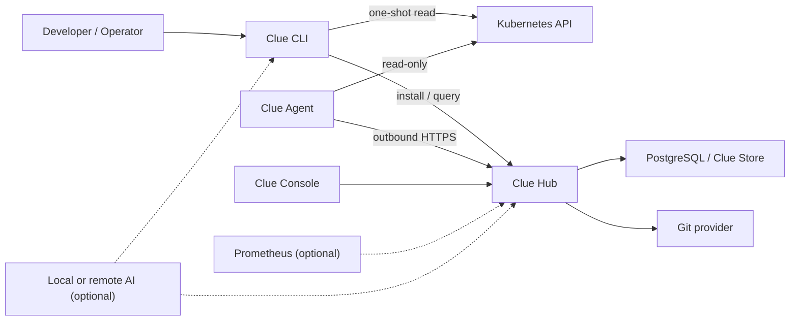

# 목표 아키텍처

## 전체 구조



## 구성요소의 책임

### Clue CLI

- Homebrew와 GitHub Release로 배포하는 단일 실행 파일
- kubeconfig를 이용한 일회성 진단
- 로컬 watch
- Hub 설치·발견·로그인·업그레이드·제거
- Fleet와 Incident 조회
- Remediation Plan 확인과 승인

CLI는 Java와 Picocli로 작성하고 GraalVM Native Image로 빌드해 사용자의 JVM 설치를 요구하지 않는 방향을 목표로 한다.

### Clue Hub

- Agent 등록과 인증
- Evidence ingestion과 Incident lifecycle
- Analyzer 실행과 Rule Pack 관리
- 사용자·조직·Fleet·권한
- 알림, 감사 로그, API와 Console 제공
- Git provider를 통한 Draft PR 생성
- Recovery Check 조정

첫 버전은 하나의 배포 가능한 모듈러 모놀리스로 만든다. 논리적 모듈은 분리하지만 독립 프로세스 15개로 시작하지 않는다. 확장이 입증된 경계만 나중에 worker로 분리한다.

### Clue Agent

- 클러스터 안에서 하나의 작은 Deployment로 실행
- Kubernetes API read-only watch/list/get
- 변경된 리소스와 필요한 Evidence만 수집
- Hub로 outbound HTTPS 연결
- 네트워크 단절 시 제한된 로컬 spool과 재전송
- Hub의 임의 shell 명령이나 `kubectl exec`를 수행하지 않음

Agent는 한 시점에 하나의 Hub identity에 소속된다. Hub endpoint만 바꾸는 것으로 소유권이 바뀌지 않으며, 재연결에는 명시적인 rotate/adopt 절차가 필요하다.

### Clue Console

- Incident 목록과 상세 Evidence
- 원인과 Rule ID
- 변경 전후 diff와 승인 상태
- Recovery Check 결과
- Agent·cluster 연결 상태
- 보존 정책과 개인정보 설정

초기 UI는 Incident 중심으로 유지하고 범용 Kubernetes Dashboard를 만들지 않는다.

### Clue Store

- 구현은 PostgreSQL
- Incident, Evidence metadata, rule version, remediation, audit, membership 저장
- 내장 PostgreSQL과 외부 PostgreSQL을 같은 schema로 지원
- migration은 Flyway가 소유

`내장 PostgreSQL`은 프로세스 내부 라이브러리가 아니다. Helm이 Clue와 함께 별도 PostgreSQL Pod/StatefulSet을 설치하는 편의 모드다.

## Java 모듈 경계

```text
clue/
├── clue-cli
├── clue-hub
├── clue-agent
├── clue-domain
├── clue-analyzer-api
├── clue-kubernetes
├── clue-persistence-postgres
├── clue-scm-github
├── clue-ai-adapters
├── clue-protocol
├── clue-console
├── deploy
└── docs
```

- `clue-domain`: framework와 DB에 의존하지 않는 Incident·Evidence·Remediation 모델
- `clue-analyzer-api`: 외부 Rule Pack이 의존할 안정적인 SPI
- `clue-protocol`: CLI/Agent/Hub 간 versioned DTO와 API 계약
- adapter 모듈이 domain이 정의한 port를 구현하는 hexagonal architecture를 사용
- Java interface는 교체 가능한 경계에서만 만들고 모든 클래스에 기계적으로 추가하지 않음
- ArchUnit으로 module dependency 규칙을 테스트

## 통신 원칙

- Agent에서 Hub 방향의 outbound HTTPS만 기본 허용
- 모든 Evidence envelope에 cluster ID, observed-at, resource UID, schema version 포함
- at-least-once 전송을 허용하고 Hub가 idempotency key로 중복 제거
- 초기에는 HTTP batch ingestion을 사용하고 규모가 필요할 때 gRPC를 검토
- NATS는 첫 필수 의존성에서 제외하고 PostgreSQL transactional outbox로 내부 신뢰성을 확보
